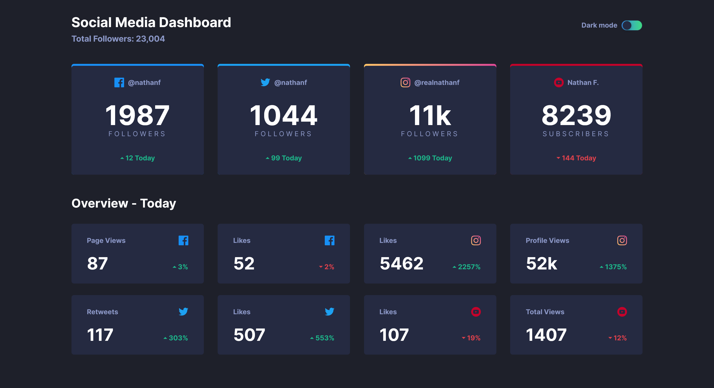

# Frontend Mentor - Stats preview card component

This is a solution to the [Social media dashboard with theme switcher challenge on Frontend Mentor](https://www.frontendmentor.io/challenges/social-media-dashboard-with-theme-switcher-6oY8ozp_H). 

## Table of contents

- [Overview](#overview)
  - [The challenge](#the-challenge)
  - [Screenshot](#screenshot)
  - [Links](#links)
- [My process](#my-process)
  - [Built with](#built-with)
  - [What I learned](#what-i-learned)
  - [Useful resources](#useful-resources)
- [Author](#author)

## Overview

### The challenge

Users should be able to:

- See hover states for interactive elements

### Screenshot

### Links

- Solution URL: [github repo](https://github.com/raffaellavinzio/social-media-dashboard-with-theme-switcher)
- Live Site URL: [git pages](https://raffaellavinzio.github.io/social-media-dashboard-with-theme-switcher/)

## My process

### Built with

- Semantic HTML5 markup
- CSS custom properties
- Flexbox
- CSS Grid
- Mobile-first workflow
- [React](https://reactjs.org/) - JS library
- [Gatsby](https://gatsbyjs.org/) - React framework
- [Styled Components](https://styled-components.com/) 

### What I learned

I learned how to implement dark mode / light mode theme toggle with styled components and CSS variables in Gatbsy

### Useful resources

- [CSS for JavaScript Developers](https://css-for-js.dev/) - This course is just awesome! 
- [Turn Off the Lights With React Context API](https://www.codewithlinda.com/blog/dark-mode-with-react-context/) - simple approach using Context API.
- [Gradient Borders in CSS](https://css-tricks.com/gradient-borders-in-css/)
- [rc-switch npm package](https://www.npmjs.com/package/rc-switch) - accessible UI switch component with easily customizable styles 

## Author

- Frontend Mentor - [@raffaellavinzio](https://www.frontendmentor.io/profile/raffaellavinzio)
